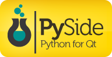

# CURSO DE PYSIDE
👨‍⚖️PYSIDE É UMA BIBLIOTECA QUE PERMITE O DESENVOLVIMENTO DE INTERFACES GRÁFICAS DE USUÁRIO (GUI) EM PYTHON. 

  

## AVISO:
Este curso aborda o uso do `PySide2`, no entanto, recomendamos utilizar o `PySide6` por ser a versão mais recente e recomendada. Portanto, enquanto o arquivo `./CURSO COMPRETO/CODIGO/CODIGO.py` utiliza o `PySide2`, o `README.md` em `./CURSO COMPRETO` foi desenvolvido utilizando `PySide6`.

Recomendamos atualizar para `PySide6` para garantir compatibilidade com as versões mais recentes e obter suporte contínuo e atualizações da biblioteca.

## CONCEITO:
PySide é uma biblioteca de software livre que permite a criação de aplicativos gráficos e interfaces de usuário em Python. Ela é baseada no Qt, uma poderosa estrutura de desenvolvimento de aplicações multiplataforma.

## SUA HISTÓRIA:
PySide começou como um projeto de vinculação Python para Qt (PyQt) e posteriormente evoluiu para se tornar uma alternativa oficial ao PyQt. A biblioteca foi desenvolvida inicialmente pela OpenBossa, uma subsidiária da Nokia, e agora é mantida pela The Qt Company.

## CARACTERÍSTICAS:
### POSITIVAS:
- **Multiplataforma:** Suporta desenvolvimento para Windows, macOS, Linux e outras plataformas.
- **Integração com Python:** Permite o desenvolvimento rápido de aplicações GUI utilizando a linguagem Python.
- **Licença:** PySide utiliza uma licença de código aberto (LGPL), o que a torna acessível para projetos comerciais e não comerciais.
- **Documentação Abundante:** Oferece uma documentação detalhada e exemplos úteis para ajudar os desenvolvedores a começar e aprofundar seu conhecimento.

### NEGATIVAS:
- **Curva de Aprendizado:** Como qualquer biblioteca poderosa, pode exigir algum tempo para os desenvolvedores se familiarizarem com todos os recursos e conceitos do Qt.
- **Versões e Compatibilidade:** Às vezes pode haver desafios com a compatibilidade entre diferentes versões do Qt e do Python, especialmente ao atualizar projetos existentes.

## SUBSIDIOS:
- [CURSO CRIADO PELO "MARGEYLSON RIBEIRO"](https://youtube.com/playlist?list=PLbWheOnk6aV4OQHkro_CUUM2hRqgBN0Jg&si=f-EwbG1krckFPPzn)
- [CURSO FEITO PELO VILHALVA](https://github.com/VILHALVA)
- [VEJA A DOCUMENTAÇÃO DO QT](https://doc.qt.io/qtforpython-6/)
- [VEJA A DOCUMENTAÇÃO DO PYSIDE](https://pyside.readthedocs.io/en/latest/)
- [LINGUAGEM DE PROGRAMAÇÃO](https://github.com/VILHALVA/CURSO-DE-PYTHON)
- [VEJA O MANUAL](./MANUAL.md)
- [VEJA A SINTAXE](./SINTAXE.md)
- [VEJA OS PROJETOS](https://github.com/VILHALVA?tab=repositories&q=topic:PYSIDE)

